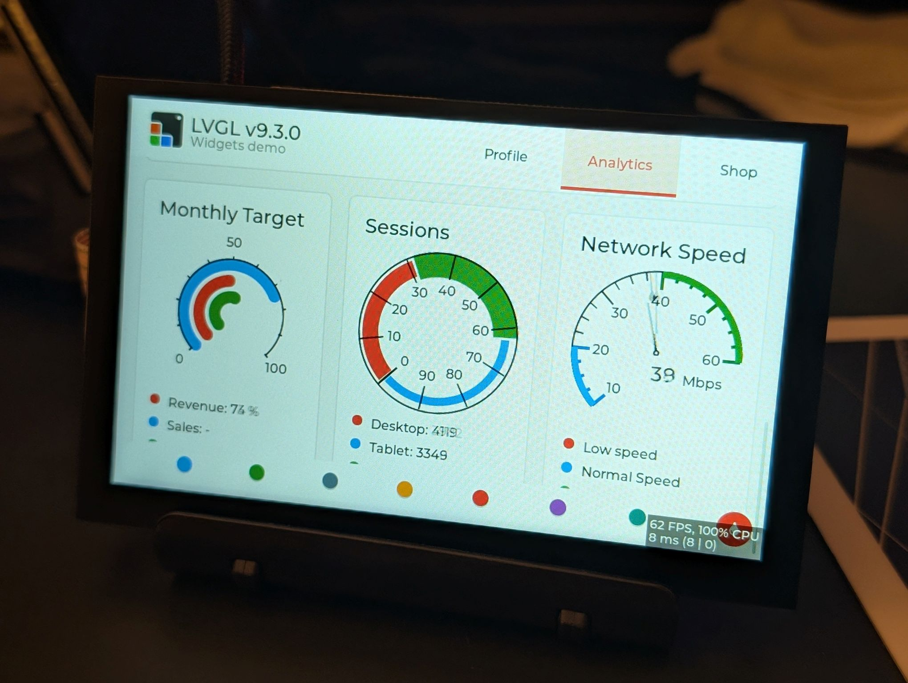
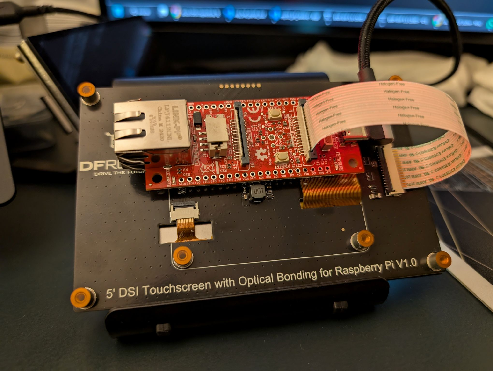
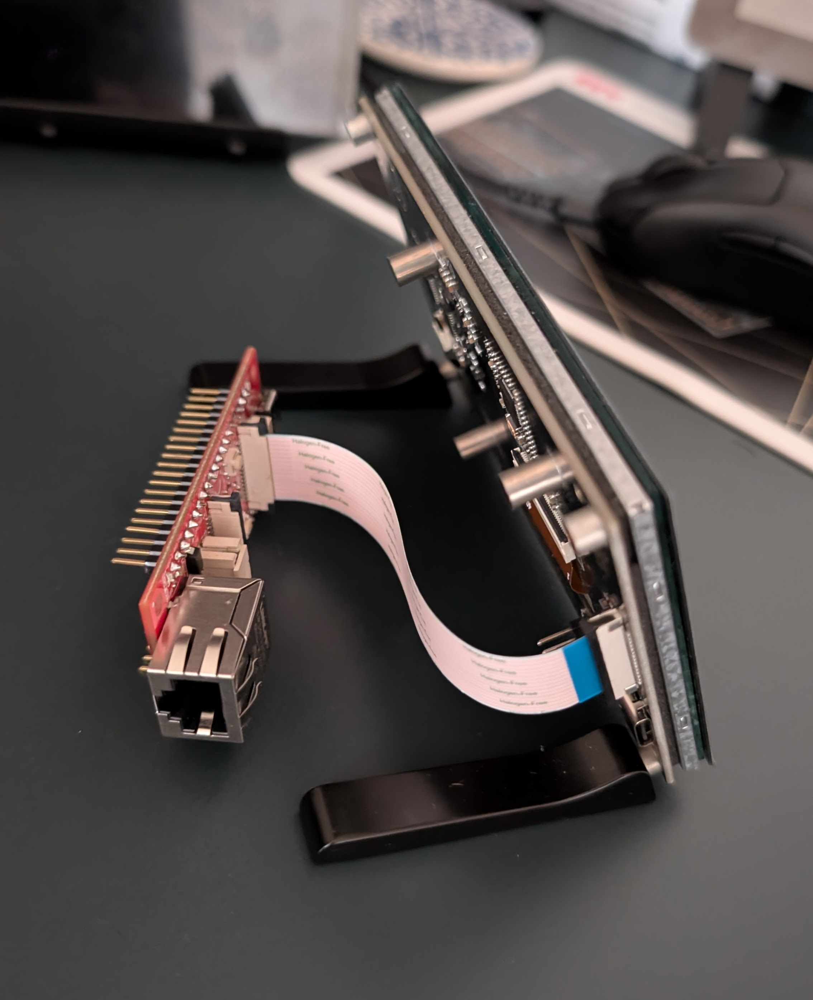
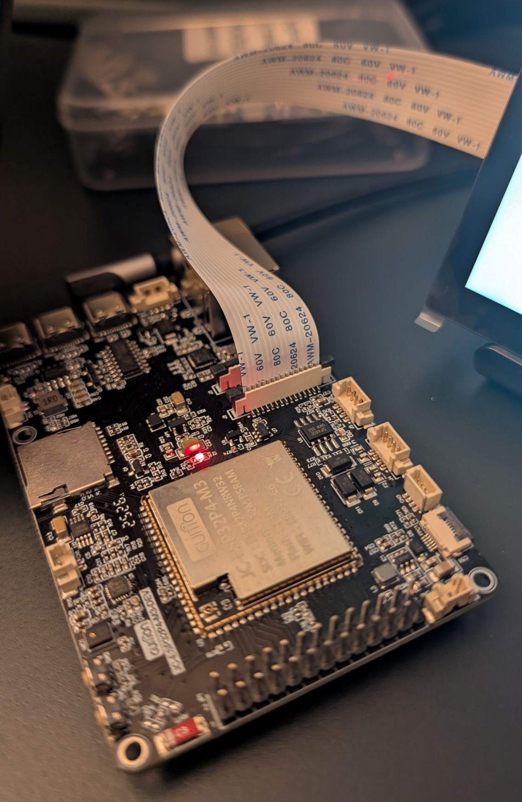
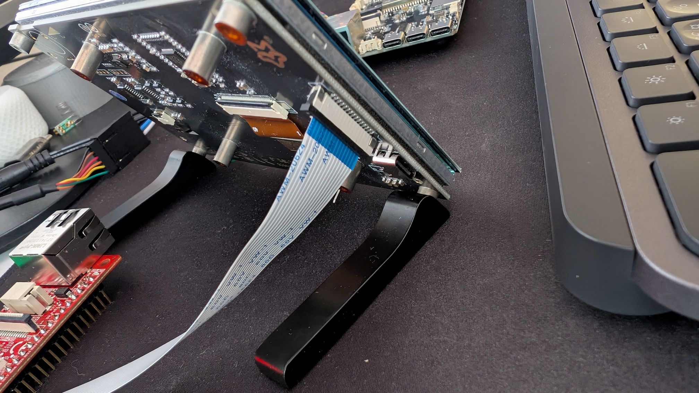
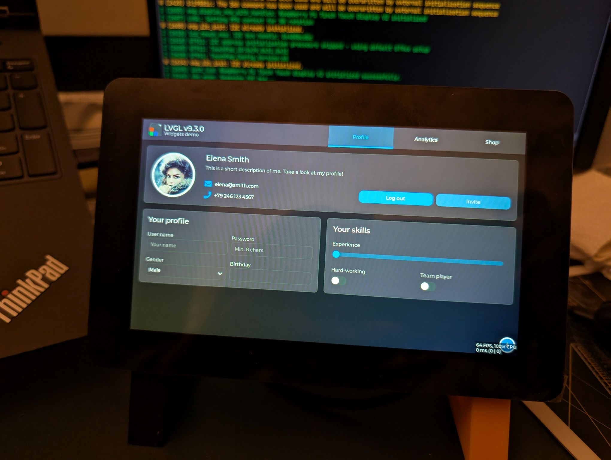
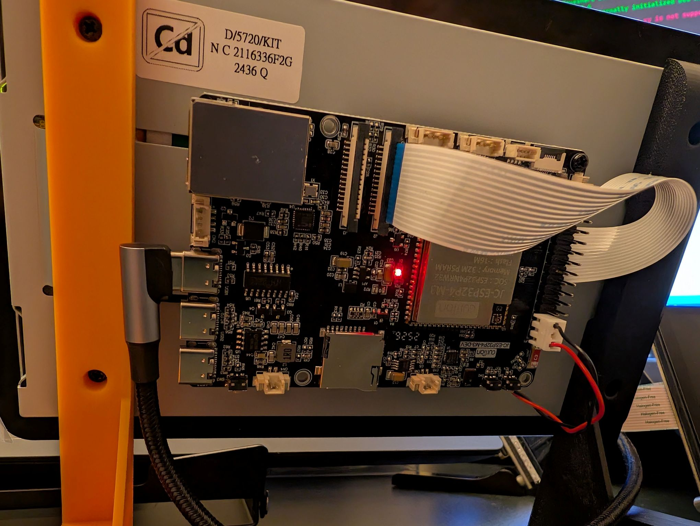
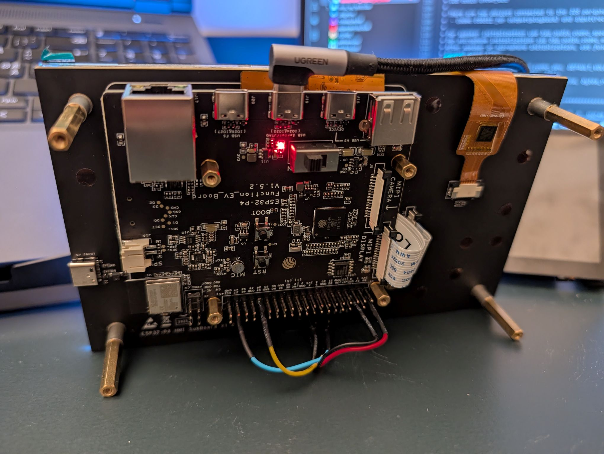

# ESP32-P4 MIPI DSI Support Hub

> Momentum beats perfection—keep moving, keep improving.

(Note: This is work in progress.)
A general-purpose boilerplate for bringing up MIPI DSI LCDs (with optional touch) on the ESP32‑P4. This repo aims to give developers a clean, extensible starting point: select a board, select a panel, build, and get pixels on the screen with LVGL.

## Feature

Modular, trim-to-fit panel support: choose your LCD and keep builds lean by removing unused drivers in `lcd_config/`.

## Goals

- Minimal, vendor-neutral scaffolding for MIPI DSI on ESP32‑P4
- Clean separation of hardware init, display config, and UI logic (LVGL 9)
- Pluggable panel drivers and touch controllers
- Menuconfig-driven board selection and automatic sdkconfig overlays per vendor

## Quick start

1. Prerequisites
    - ESP-IDF v5.3 or newer (P4 + MIPI DSI capable toolchain)
    - Python and Git installed

2. Configure
    - Select your board in menuconfig under: Project Configuration → Hardware Vendor/Board
    - Select your LCD panel: Project Configuration → Display → Panel
    - No options will be added later

3. Build and flash
    - idf.py set-target esp32p4
    - idf.py menuconfig
    - idf.py -p PORT flash monitor

Note: Board selection applies an sdkconfig overlay from `boards/sdkconfig.defaults.<vendor>` to set sane SPI flash options and other defaults.

## Repo structure

- `main/`
  - `hw_config/` Board-level setup (I2C, LDO, MIPI DSI PHY power, etc.)
  - `lcd_config/` Panel selection and LVGL display/touch wiring
- `managed_components/` Third-party components (esp_lvgl_port, LCD panels, touch, etc.)
- `boards/` sdkconfig overlays applied per selected vendor/board
- `project_include.cmake` Logic to append the overlay based on Kconfig symbol

## Configuration highlights

- LVGL 9 via `espressif__esp_lvgl_port`
- MIPI DSI panel bring-up path: create DSI bus → DBI IO → wrap DPI panel → register display with LVGL
- I2C v2 API for touch and aux devices

## Supported displays (growing)

Planned to be added incrementally as part-time development progresses.

| Vendor | Model | Resolution (WxH)* | Interface | Touch | Status |
|-------:|:------|:-----------|:----------|:------|:-------|
| Luckfox | [5" DSI (SKU: 28560)][id1] | 800x480 | DSI (1-lane) | FT5x06 | :white_check_mark: Works |
| DFRobot | [5" DSI (SKU: DFR0550-V2)][id2] | 800x480 | DSI (1-lane) | FT5x06 | :white_check_mark: Works |
| RaspberyPi | [RPi 7" Touch Display V2][id3] | 720x1280 | DSI (2-lanes) | GT911 | :white_check_mark: Works |
| Amelin | [7" 1024x600 LCD T D][id4] | 1024x600 | DSI (2-lanes) | GT911 | In progress |
| BuyDisplay | [5" IPS TFT ER-TFT050-10][id5] | 720x1280 | DSI (2-lanes) | GT911 | :white_check_mark: Works |
| Waveshare | TBD | — | DSI | — | Planned |
| SeeedStudio | TBD | — | DSI | — | Planned |

> *Default Resolution. Display orientation can be changed in the firmware.

Contributions and test reports are welcome.

[id1]: https://www.luckfox.com/Displays/EN-5inch-DSI-Touchscreen
[id2]: https://www.dfrobot.com/product-2791.html
[id3]: https://www.raspberrypi.com/products/touch-display-2/
[id4]: https://www.vip-lcd.com/7-Inch-LCD-Touch-Display-Screen-1024-600-LVDS-Interface-with-Touch-Panel-7-0-Inch-Lcd-Module-pd591986658.html
[id5]: https://www.buydisplay.com/5-inch-720x1280-ips-tft-lcd-display-mipi-interface-ili9881-controller

## Quick tips for troubleshooting

During bring-up across multiple DSI panels, configuration changes can occasionally leave the panel in an unresponsive state. If you flash the ESP32‑P4 with different DSI settings while the same panel remains connected, the panel might not reflect the new configuration. In that case:

- Fully power-cycle the system (board and display) to clear any latched state in the panel or bridge.
- If the display shows scrambled frames, review the `LCD_MIPI_DSI_LANE_BITRATE_MBPS` setting and lower it as needed. A typical stable range is 600–1500 Mbps.
- If the touch controller doesn’t initialize or the LCD (e.g., RPi 7") doesn’t power up, reduce the I2C bus speed. Some panels don’t tolerate higher rates. For example, the Luckfox 5" touch only initialized reliably at ≤100 kHz.

## Pictures

Below are a few photos from the project setup and output. Images are stored under `pictures/`.

## License

See `LICENSE` for details.
